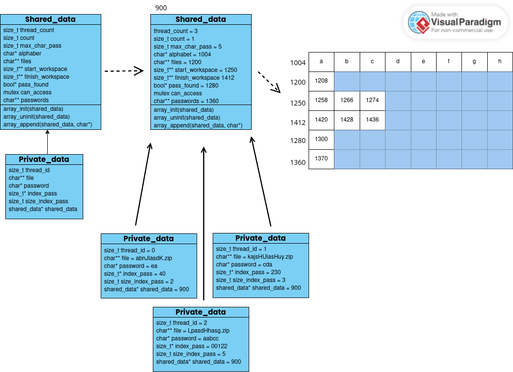

 # Diseño Gráfico

En la imagen se refleja la estructura de datos utilizada, un arreglo dinámico. Primero se representa de manera cruda, y luego se rellanan sus campos simulando un caso de prueba. Se observa la dependencia de private_data hacia shared_data, pues este lo utiliza como un atributo. Además, se representan los campos alojados en la memoria `heap` y sus valores.

