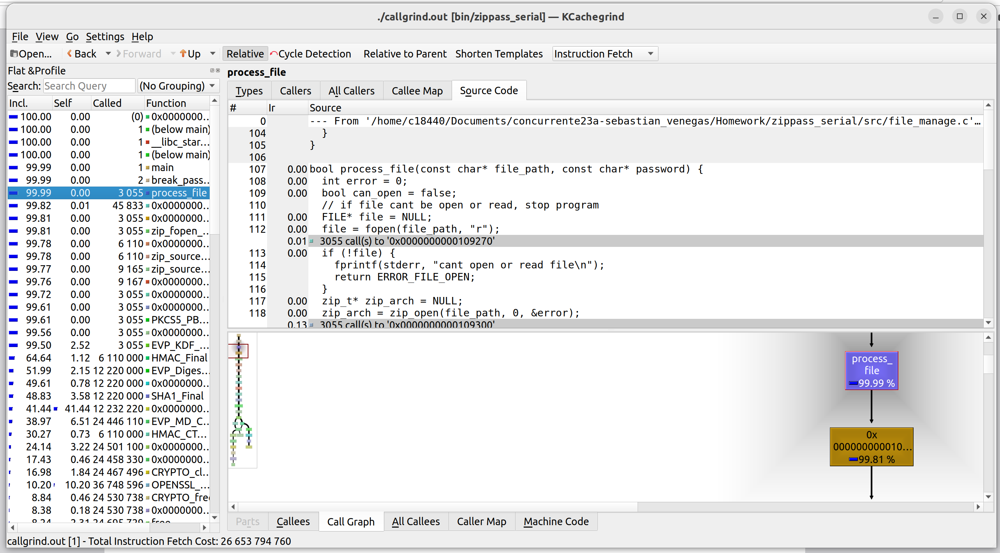
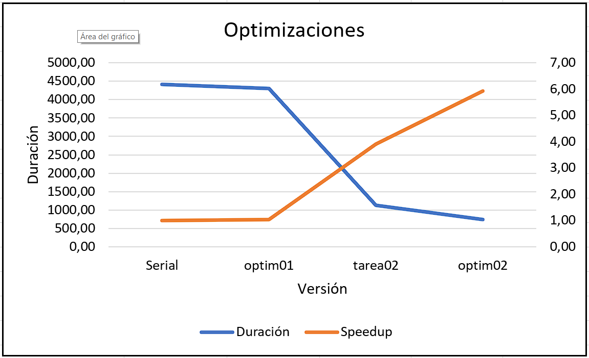
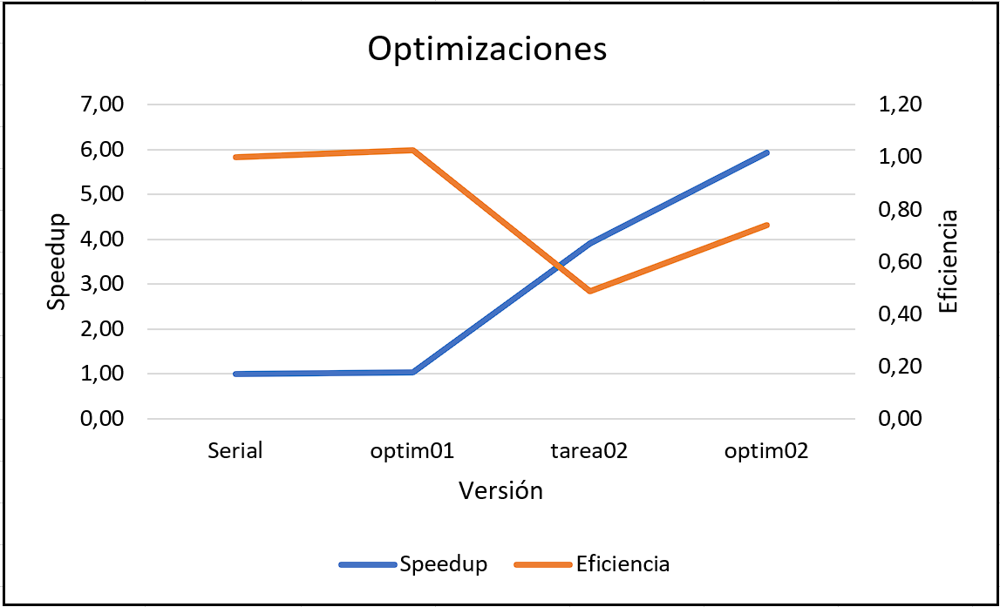
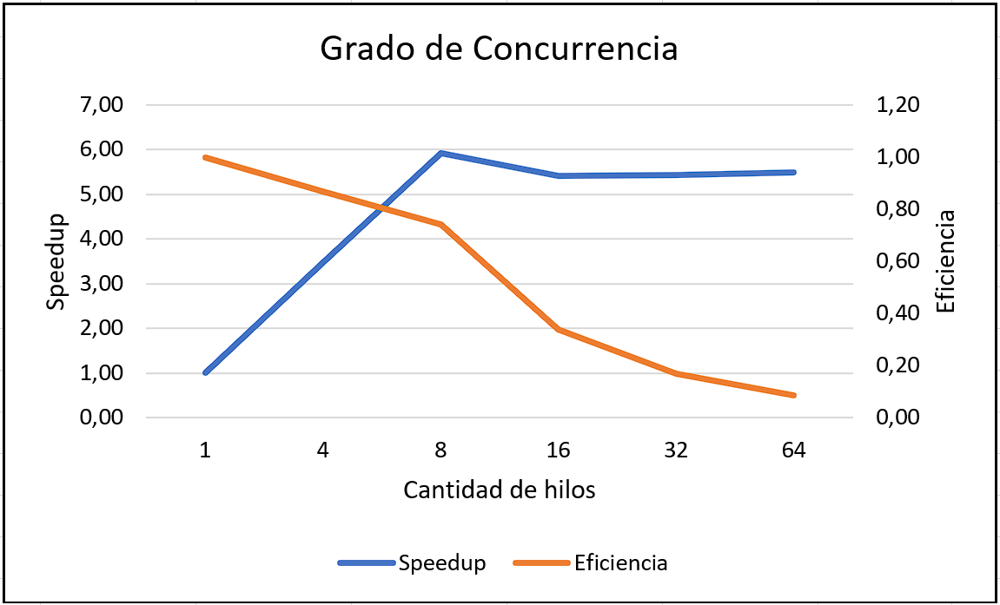

# Zippass Reporte

> ## Serial Optimized Reporte

Para la optimización serial del código, se utilizó la herramienta Kcachegrind para poder averiguar qué parte del código consumía la mayor cantidad de tiempo. Se llegó a la conclusión que el abrir el archivo zip y lo relacionado a este era lo que más duraba en la ejecución del programa.

Por lo que, como optimización se optó por mover ese fragmento de código, para que solo abriera los archivos una vez. Logrando un mayor desempeño, un speedup y una mayor eficiencia; pues era lo que más atrasaba en la ejecución, como se observa en la siguiente imagen:

> ## Pthread Reporte

En esta optimización, se decidió utilizar la tecnología `pthread` para realizar concurrencia de tareas. Se hace un mapeo estático, el cual se divide bloques de trabajo (las iteraciones para encontrar la siguiente posible contraseña). Al dividir el trabajo en hilos, se logra una mayor eficiencia y un speedup para encontrar las contraseñas.

> ## Pthread Optimized Reporte

Se realiza una posible optimización a la anterior, al realizar un mapeo dinámico. Donde un hilo `produce` las posibles contraseñas y los otros `consumen` para abrir los archivos y verificar la contraseña. Existe la concurrencia de tareas por parte de los consumidores, pues es el "trabajo fuerte" y donde se emplea una mayor cantidad de tiempo.

Con la concurrencia de tareas (hilos) y el mapeo dinámico, se logra una mayor eficiencia y speedup al algoritmo o programa inicial (`zippass_serial`).

> ## Comparación de optimizaciones

Debido a la realización de varias optimizaciones, es muy enriquecedor poder comparlas entre sí para determinar cuál aportó más al incremento del desempeño (`speedup`) o genera mejor eficiencia. Todas las mediciones se realizaron en la misma máquina y con el mismo [caso de prueba](../pthread_optimized/tests/input006.txt). Las versiones a comparar son:
- Serial
- Serial Optimizada
- Pthread
- Pthread Optimizada (mapeo dinámico)

Y las medidas a comparar entre las optimizaciones son la Duración de las versiones ejecutando el programa y el Speedup "ganado". En el siguiente gráfico se puede observar los resultados obtenidos:

Como se observó, se logra una reducción de tiempo con cada optimización (obteniendo el mejor tiempo con la optimización de Pthread mapeo dinámico) y simultáneamente crece el speedup, pues el speedup tiene una correlación con la duración del programa.

Además, también se estudió o analizó el nivel de eficiencia (con 8 hilos) en contraste del speedup.En el siguiente gráfico se observa la relación entre ambos ejes y los resultados:

Del gráfico anterior se puede concluir que la eficiencia va incrementando en cada optimización, mientras que el speedup tiene una decaída y luego vuelve a subir. Esto se debe a la duración de cada versión en comparación a la versión base u original (Serial).

> ## Grado de concurencia

De igual manera, se compararon las optimizaciones a nivel de concurrencia (cantidad de hilos y su desempeño); para lograr estas comparaciones, igual que las anteriores, se realizaron en la misma máquina, con el mismo [caso de prueba](../pthread_optimized/tests/input006.txt) y las mismas versiones.

Para realizar las comparaciones, se usaron 6 niveles de concurrencia en función de C, es decir  se registraron en la hoja de cálculo 6 mediciones de la duración de los programas:
- 1 hilo de ejecución
- 4 hilo de ejecución
- 8 hilo de ejecución
- 16 hilo de ejecución
- 32 hilo de ejecución
- 64 hilo de ejecución

En el siguiente gráfico se registran los resultados obtenidos:

En el gráfico se logra notar como la eficiencia decae conforme se aumenta el costo de ejecutar el programa (en este caso, la creción de hilos) a tal punto de tener una eficiencia de cerca o semejante a 0 en el valor de 64 hilos. Esto se puede explicar por la saturación de trabajo entre los "trabajadores" y la saturación de los CPU.

Asimismo, se percibe como el "pico" de speedup se presenta cuando se utilizan 8 hilos o "trabajadores". Se debe a que la máquina donde se realizaron las pruebas, tiene 8 núcleos físicos logrando el mayor desempeño y mejor división de trabajo. Siendo el punto óptimo para realizar el trabajo, teniendo el mayor balance entre speedup y eficiencia.

### Creditos
---
Sebastian Venegas Brenes

Correo: sebastian.venegas@ucr.ac.cr
