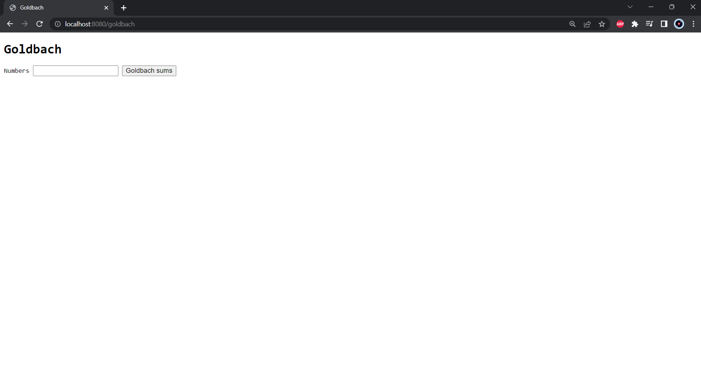
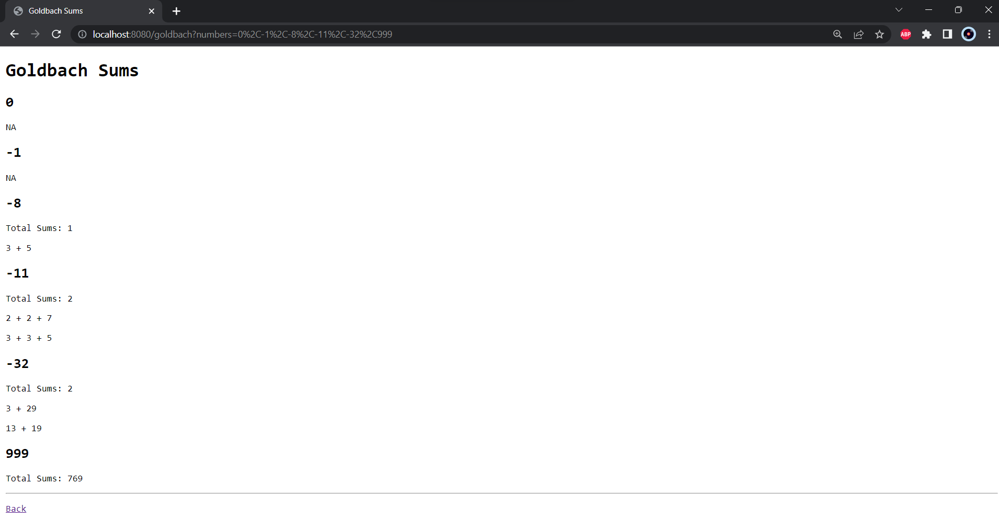
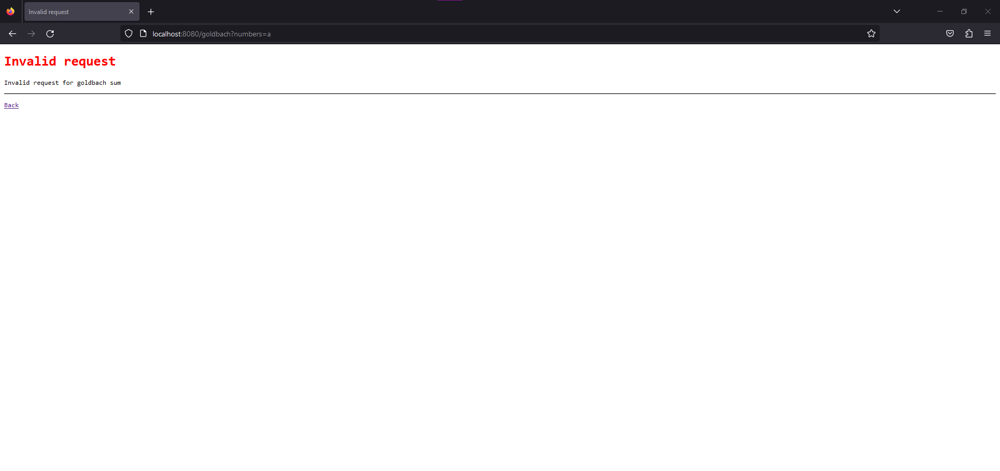
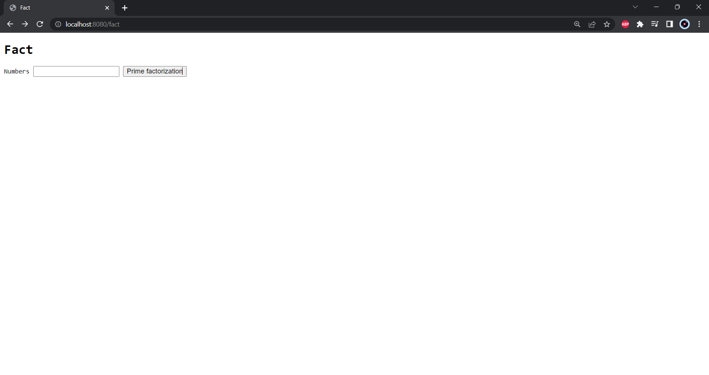
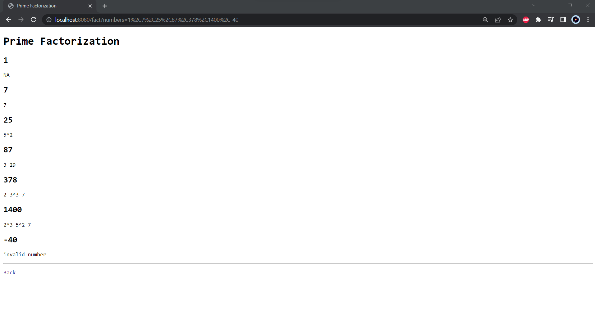

# Proyecto 1

## 1.1 Descripción del problema y requerimientos

El problema consiste en el desarrollo de un servidor web concurrente, esto para tener la posibilidad de atender varias conexiones (clientes) al mismo tiempo y calcular sus respectivas sumas de Goldbach, en donde dicho servidor web ya viene dado de manera serial y el equipo modificara dicho servidor utilizando el patrón Singleton y haciéndolo concurrente, además creando una clase HttpConnectionHandler que permita utilizar el patrón Productor_Consumidor para consumir y enrutar los Sockets para poder ser manipulados por la clase GoldbachCalculator la cual se utilizara para cálcular las sumas de goldbach usando la Criba de Eratóstenes y utilizando la clase GoldbachWebApp para mostrar dichos resultados en la página web, esto utilizando el patrón Modelo_Vista_Controlador en donde GoldbachCalculator representara el modelo, GoldachWebApp representara la vista y el servidorWeb representa el controlador.

# 1.2 Ejecución del servidor

A continuación, se mostrara un ejemplo de cómo funciona el servidor web.

## Goldbach

#### Pagina de inicio



#### Resultado de entrada de varios números



#### Entrada invalida



## Prime Factorization



#### Resultado de entrada de varios números




Enlace al documento de diseño: [Design](design/design.md)
## 1.3 Manual de Usuario

Para correr el servidor web primeramente, hay que crear un ejecutable utilizando la terminal de línea de comandos de Linux siguiendo las siguientes instrucciones:

1.3.1 Abra la terminal en el repositorio `concurrent23a-proyects` e ingrese a la carpeta `project1.1` mediante el siguiente comando: `cd /projects/project1.1`

1.3.2 Ahora cree un ejecutable con el siguiente comando: `make clean && make`.

1.3.3 Para ejecutar el servidor web, utilice el siguiente comando: `bin/project1.1 (puerto) (número de conexiones)` en donde el primer argumento es el puerto al cual se desea que se asocie el servidor web, dicho número de puerto de red tiene que estar entre 1024 y 65535, el segundo argumento es el número máximo de conexiones de clientes que el servidor web debe permitir de manera concurrente.

Ejemplo:`bin/project1.1 1024 4`

Por defecto si no se añaden argumentos se utiliza el puerto `8080` y se utiliza el número de CPUs de la maquina como máxima cantidad de conexiones.

1.3.4 Para acceder al servidor web, debe dirigirse a su buscador de preferencia y escribir localhost:"puerto". Por ejemplo, si ingresó el puerto 1024 el local host debería verse así:
```
localhost:1024/goldbach
localhost:1024/fact
```
1.3.5 Una vez que se ingresó al localhost en el navegador, se mostrará la página web en donde se puede ingresar uno o varios números separados por comas y se podrá ver sus respectivas sumas de Goldbach.

1.3.6 Mientras el servidor web siga corriendo, se puede cerrar la conexión dentro de la terminal con el comando `kill` o con `CTRL+C`.

## Créditos

#### Proyecto
Adrián Rivas Campos <adrian.rivas@ucr.ac.cr>

Antony Leonardo Picado Alvarado <antony.picado@ucr.ac.cr>

Dario Murillo Chaverri <dario.murillo@ucr.ac.cr>

Sebastián Venegas Brenes  <sebastian.venegas@ucr.ac.cr>
#### Aporte en la Criba de Eratóstenes
Omar Gaxiola https://www.lawebdelprogramador.com/foros/usuario.php?id=193645
