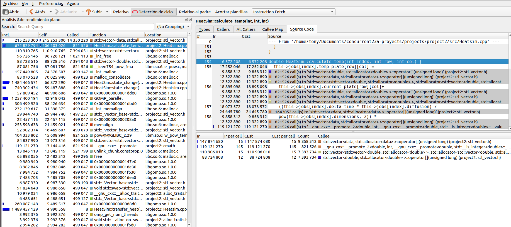
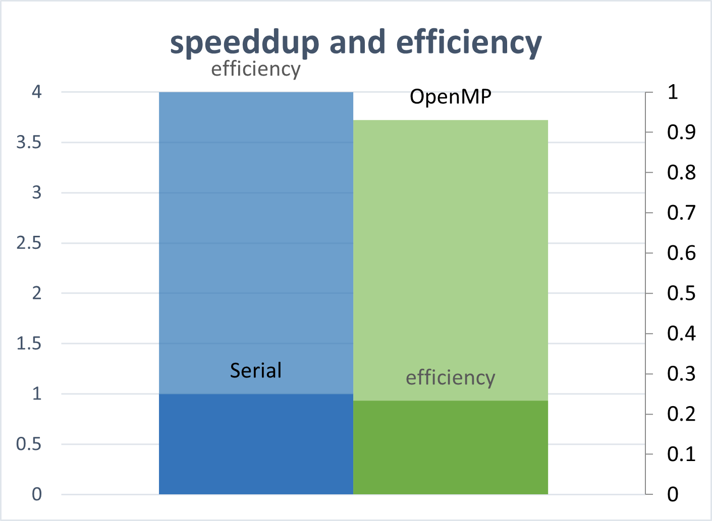

# Paralelizacion-Concurrencia Declarativa

Una vez que la simulacion de transferencia de calor fue construida mediante programacion serial, se pudo observar que conforme mas se queria aproximar el modelo a la realidad, se requerian casos de pruebas mas precisos, es decir, casos con una gran cantidad de filas y columnas y con cambios de temperatura mas pequeños, lo cual al mismo tiempo, imponen un mayor tiempo de duracion al tomar mas tiempo de procesar, por lo tanto se decidio paralelizar el programa con el fin de obtener un mejor desempeño, en este caso se decidio llevar a cabo la paralelizacion mediante el paradigma declarativo con la tecnologia de openmp, para analizar si se consiguieron los resultados deseados se llevara a cabo el ciclo de optimizacion propuesto.

## Rendimiento

De manera inicial, se decidio medir el rendimiento de la version serial del programa con un caso de pruebas grandes, en este caso el job003, la medicion se realizo en una computadora local con 16 nucleos, no se pudo utilizar el cluster de computadoras debido a que no esta habilitado. La duracion de este caso de pruebas fue de 461.916 segundos es decir aproximadamente 7 minutos.

## Profiling

Una vez que se analizo el tiempo de duracion de la version serial, se realizo profiling mediante la herramiento callgrind para identificar que partes del codigo requieren mayor procesamiento, y por lo tanto, identificar cuales partes del codigo son candidatas a paralelizar para mejor el rendimiento

Datos reportados por callgrind al correr la simulación con un solo hilo de ejecución, en donde se muestra el consumo de la subrutina calculate_temp.

Al utilizar callgrind y el programa de visualización kcachegrind se confirmó la conjetura del equipo de que la parte candidata a paralelizar es propiamente el cálculo de la temperatura de las placas.

## Diseño

Una vez analizados los resultados obtenidos, procedemos a proponer una potencial mejora en el codigo. En este caso, se utilizara concurrencia declarativa mediante la tecnologia de openmp para paralelizar el programa, mas especificamente, se utilizara la directiva de omp for para paralelizar la actualizacion de calor de las celdas, con la espera de que repartir el trabajo de recorrer la matriz y calcular la nueva temperatura, entre distintos hilos reduzca el tiempo de procesamiento.

## Análisis de rendimiento

Grafico donde se muestra el incremento de velocidad y la eficiencia del programa al paralelizarlo.

Una vez que se aplico la paralelizacion y se probo su correctitud con distintos casos de prueba, se procedio a medir su rendimiento, para identificar si los cambios propuestos habian cumplido el proposito de mejor el rendimiento del porgrama. Luego de probarlo con el mismo caso de pruebas con el cual se midio inicialmente el rendimiento de la version serial, nos damos cuenta de que dicha paralelización causo un incremento de velocidad de aproximadamente el 318% (3.18) con respecto a la versión serial, utilizando 8 núcleos de la maquina a la vez, y al utilizar 16 núcleos de la máquina, se vio un incremento del 372% (speeddup del 3.72) casi 4 veces más rápido con respecto a la versión serial, esto utilizando un caso de prueba grande como lo es job003. Por lo que de manera conclusiva, podemos afirmar que la paralelizacion fue correcta y causo un aumento de desempeño significativo en el programa.
